* [Windows](#Windows)
* [Linux](#Linux)
* [MacOS](#MacOS)

## Windows

* test1  
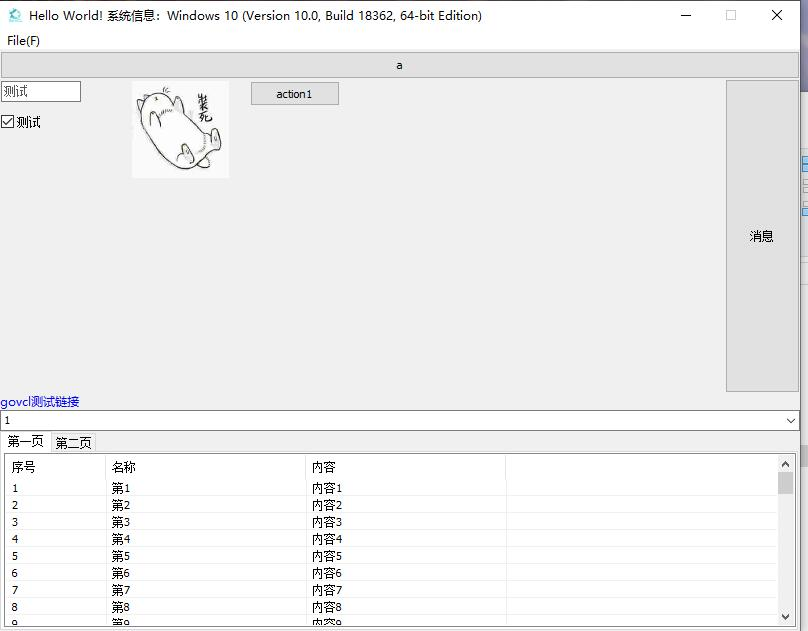   
* test2  
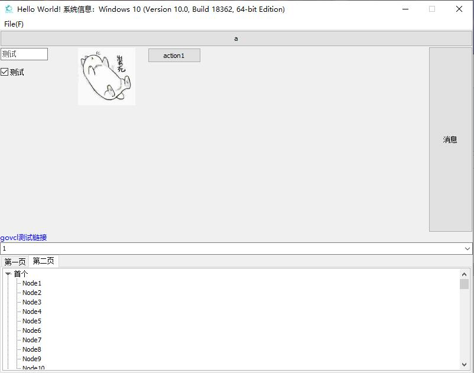      
* 自绘(custom draw)    
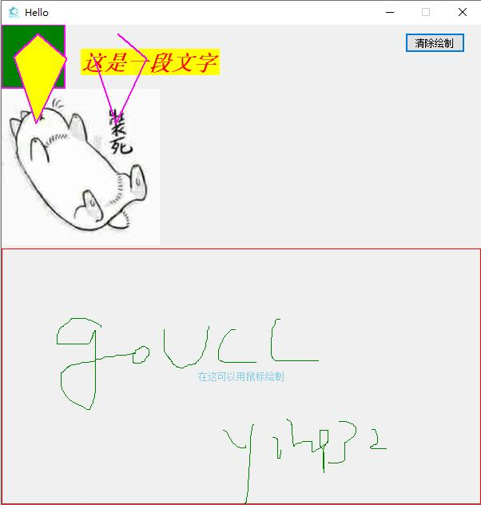  
* ListView   
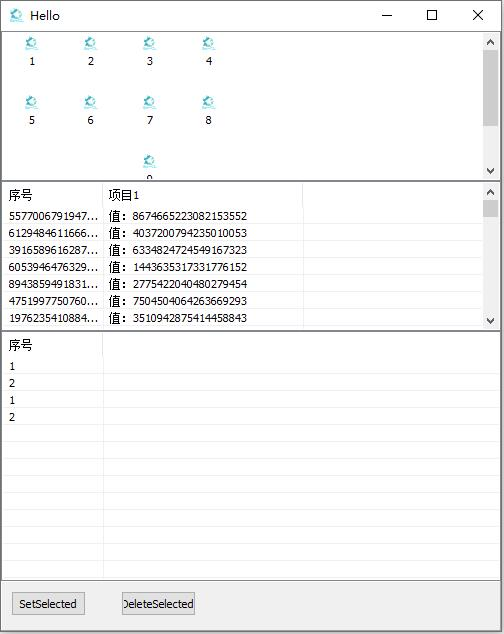  
* 标准控件(standard control)    
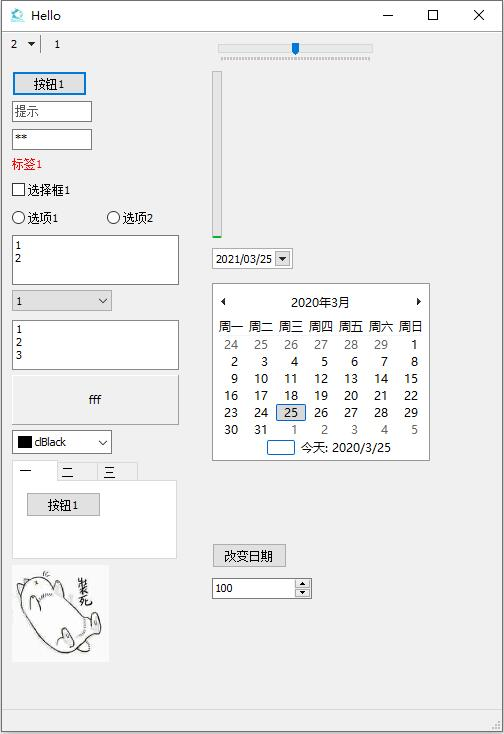   
* 四态图像按钮(image button)  
   
* 从资源中加载窗口(resouce form)   
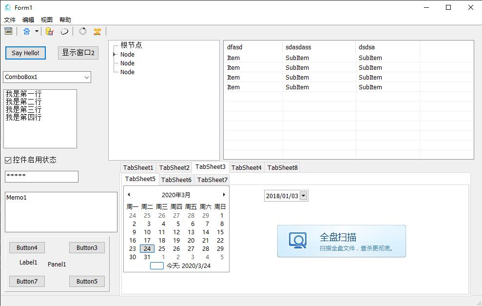  
* libvcl MiniWebview   
 
* liblcl MiniWebview 
 
* 基于bass的mp3Player
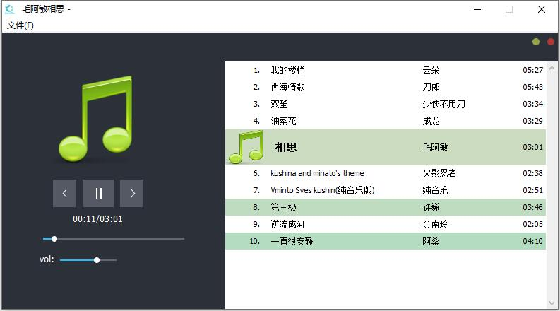 

---
## Linux
### Ubuntu 16.04 

* test1  
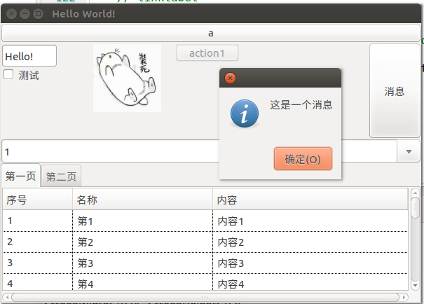  
* test2  
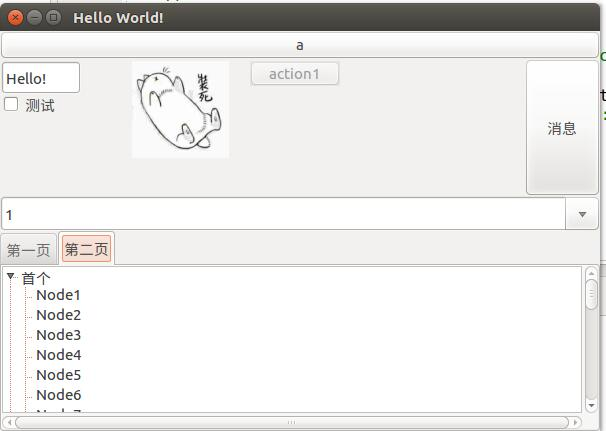  
* 标准控件  
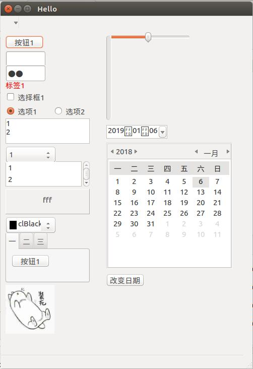   
* 自绘  
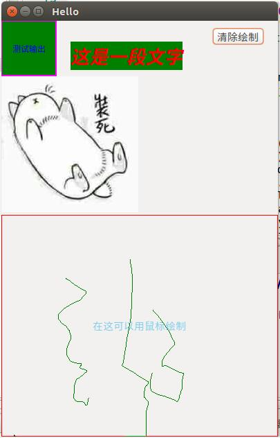  
* 复选列表框  
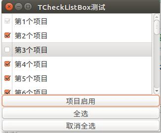  
* 四态图像按钮  
  
* 基于bass的mp3Player Linux Mint
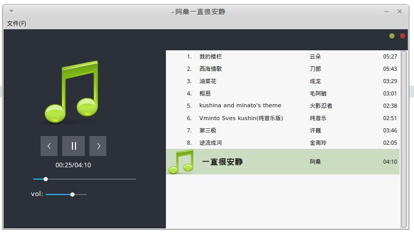 

* liblcl MiniWebview gtk2接口
 

* Deepin  
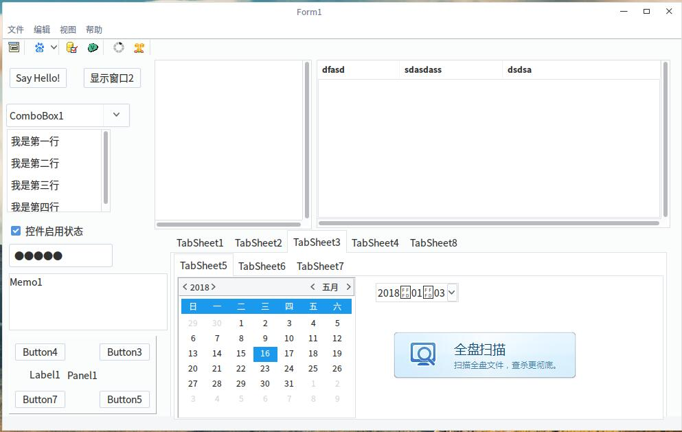  
* Mint  
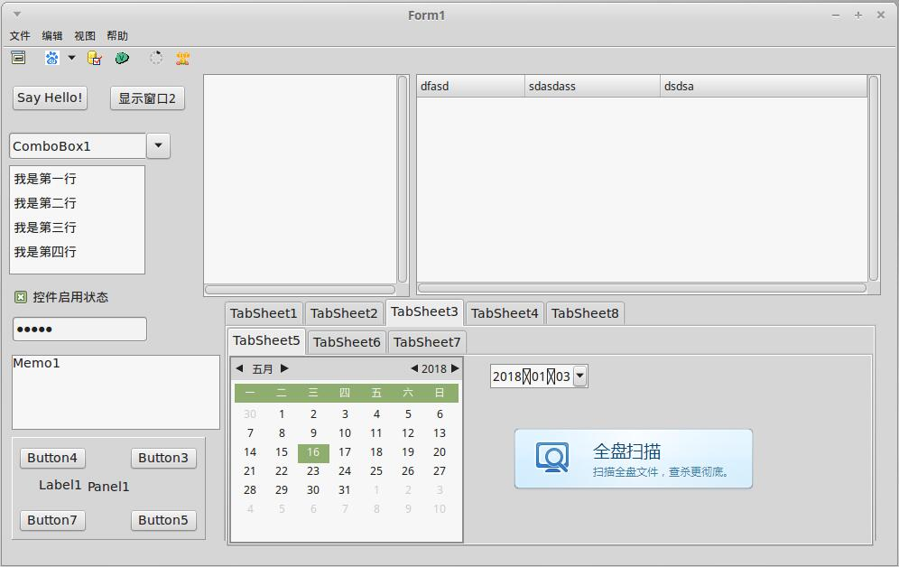  
* Ubuntu  
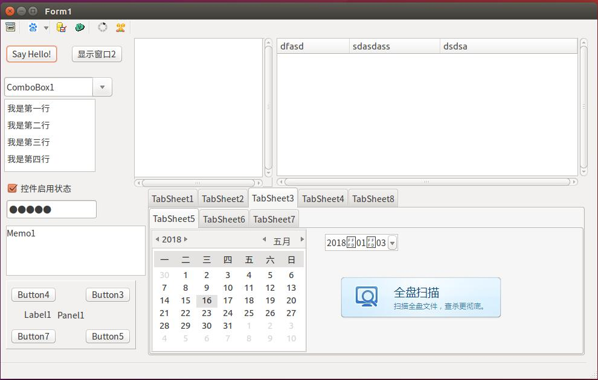  

* Raspberry Pi(ARM)(Simply tested)  
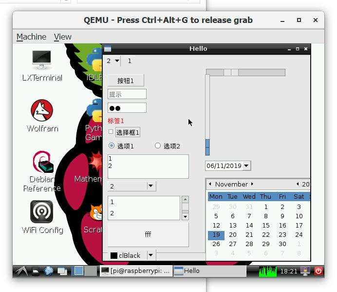

---
## MacOS

* test1  
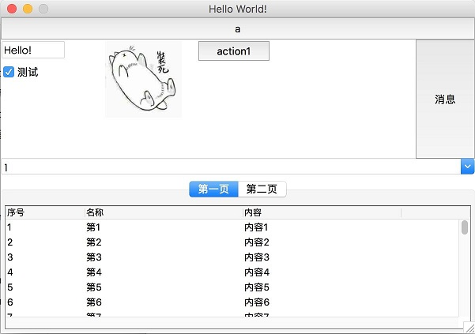  
* test2   
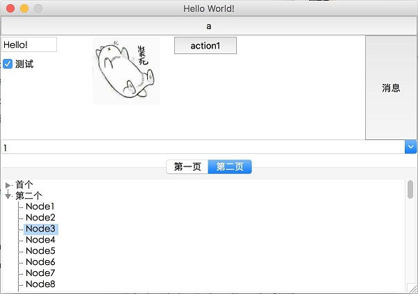  
* 自绘   
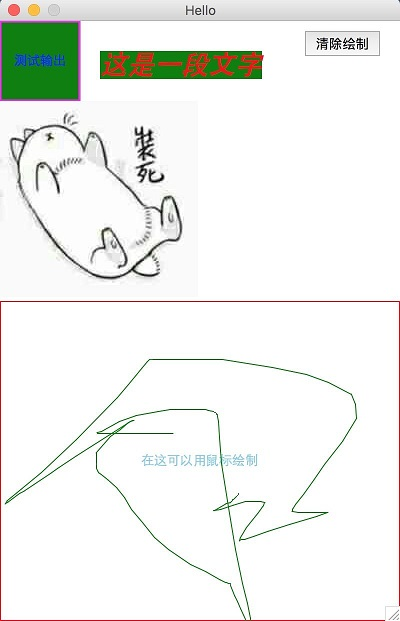   
* 复选列表框    
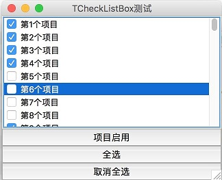  
* 标准控件   
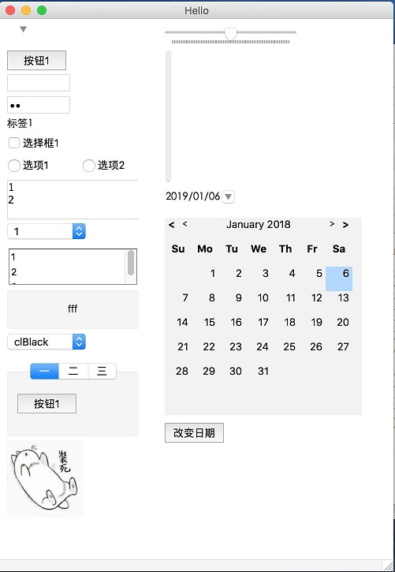  
* 四态图像按钮  
  
* 资源窗口    
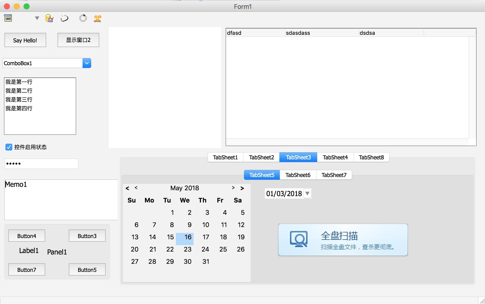  
* liblcl MiniWebview cocoa接口
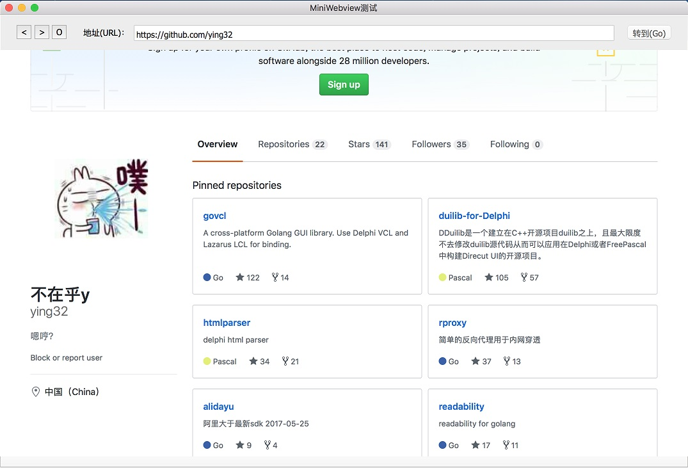 
* 基于bass的mp3Player  
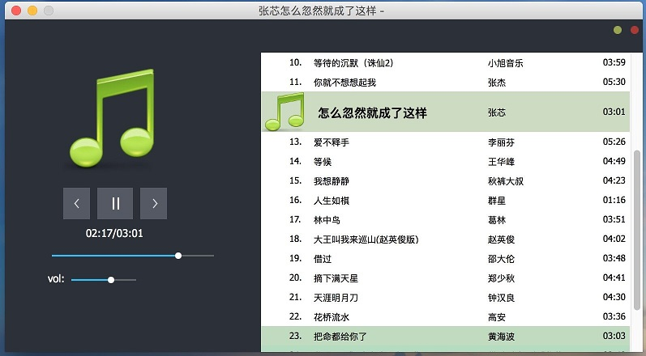 