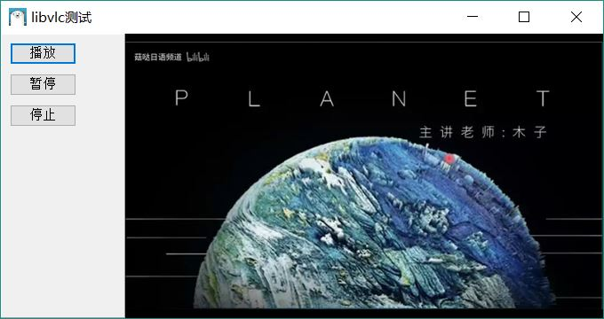
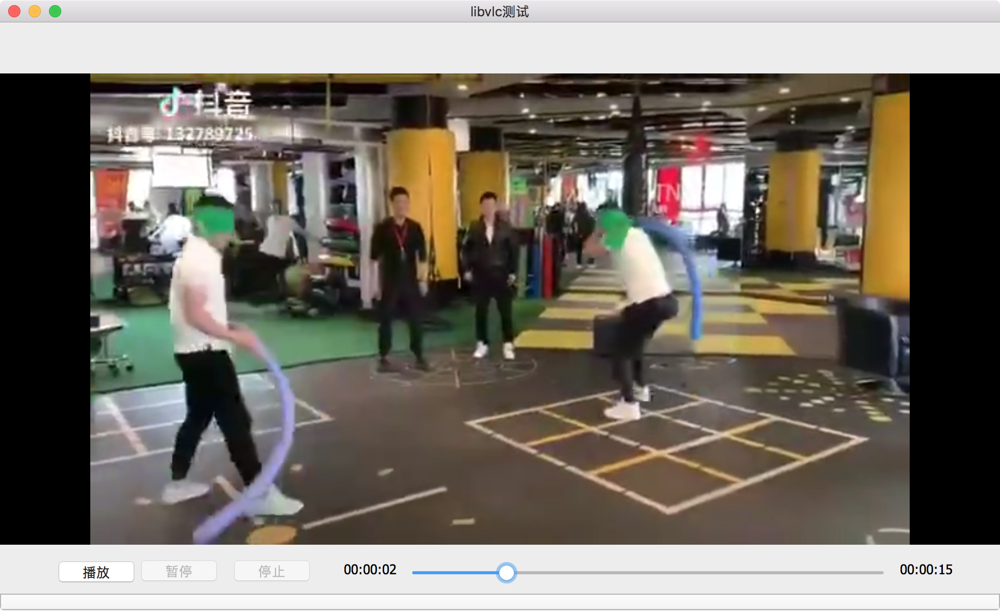

简单的libVLC库测试

* Windows 
下载vlc 32或者64位安装包   

复制libvlc.dll、libvlccore.dll及plugins目录到当前exe运行的目录。   

已测试环境：win64, macOS   

* 注： macOS下，将libvlc的几个库放在当前目录下的lib下，然后复制plugins到当前目录下   

**注：因为是测试，所以只简单的封装了几个api，目地在于测试可行性**  

*   
*   